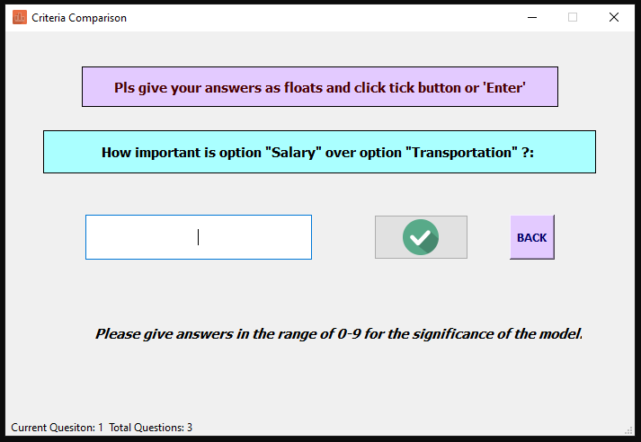

# Criteria_Comparison_App
Criteri Comparison App for Analytic Hierarchy Process Method

There are 4 main pages and one extra page.

main.py
criteria.py
ask.py
result.py
+
scale.py

Each page performs the functions shown in the photos below. (Except scale, scale only includes the comparative advantage table...)

